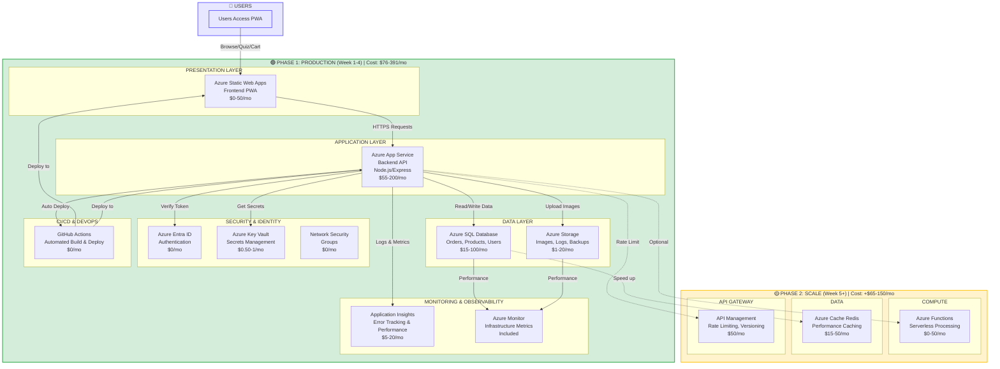

This Mermaid diagram can be:

1. **Rendered Online** → Copy to [mermaid.live](https://mermaid.live) → Export as PNG/JPEG
2. **Rendered in GitHub** → Push to GitHub repo, it displays as image
3. **Converted to Image** → Use tools like:
   - [Kroki.io](https://kroki.io) - Drag & drop
   - [Mermaid CLI](https://github.com/mermaid-js/mermaid-cli) - Command line
   - VS Code extensions (Mermaid Preview)

---

## 🔄 Quick Way to Get JPEG

**Option 1: Online (Easiest)**
1. Go to https://mermaid.live
2. Paste the diagram code (from `ARCHITECTURE_DIAGRAM.md`)
3. Click Export → PNG/JPEG

**Option 2: VS Code Extension**
1. Install "Mermaid Preview" extension
2. Open file and preview
3. Right-click → Export as image

**Option 3: Command Line**
```bash
npm install -g @mermaid-js/mermaid-cli
mmdc -i diagram.mmd -o diagram.png
```

---

Would you like me to:
1. ✅ Create more detailed Mermaid diagrams?
2. ✅ Generate PlantUML diagrams (alternative format)?
3. ✅ Create text descriptions you can use in draw.io or Lucidchart?

Let me know! 🎯
